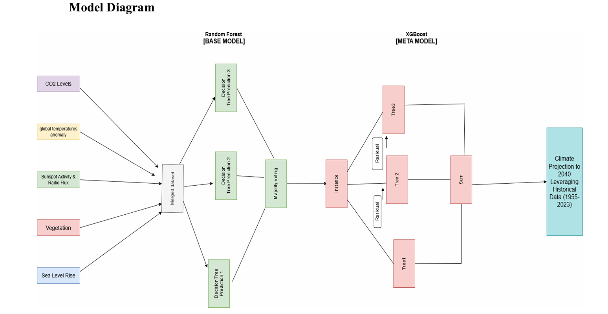

# Climate Change Forecasting Model 🌍

A machine learning-based climate change forecasting system that uses historical data from multiple sources to predict future climate trends. The project implements **ClimateStack**, a stacking ensemble model combining Random Forest and XGBoost regressors to quantify climate change impacts.


## 📊 Features

- **Multi-Source Data Integration**: Combines CO₂ concentration, temperature, sunspot flux, and forest size data
- **Advanced ML Model**: ClimateStack ensemble model (Random Forest + XGBoost)
- **Comprehensive Visualizations**: 
  - CO₂ concentration trends over time
  - Temperature component analysis (seasonal breakdown)
  - Sunspot flux patterns
  - Climate change quantification curves with 5-year rolling averages
- **Long-term Forecasting**: Predictions from 1958 to 2040
- **High Accuracy**: Achieves strong R² scores on test data

## 🚀 Installation

### Prerequisites

- Python 3.7 or higher
- pip package manager

### Setup

1. **Clone the repository**
   ```bash
   git clone https://github.com/yourusername/climate_change_forecast.git
   cd climate_change_forecast
   ```

2. **Install dependencies**
   ```bash
   pip install -r requirements.txt
   ```

## 📁 Project Structure

```text
climate_change_forecast/
├── data/               # CSV datasets
├── src/                # Python source code
│   └── forecast_code.py
├── images/             # Visual assets
├── README.md
├── LICENSE
└── requirements.txt
```

## 📖 Usage

Run the forecasting model:

```bash
python src/forecast_code.py
```

The script will:
1. Load and process climate data from CSV files
2. Generate visualizations for each dataset
3. Train the ClimateStack ensemble model
4. Display model performance metrics (R², MAE, RMSE)
5. Generate forecast plots from 1958 to 2040

## 📁 Data Sources

The project uses the following datasets:

| Dataset | Description | Source |
|---------|-------------|--------|
| `data/co2_mm_mlo.csv` | Monthly mean CO₂ concentrations | [NOAA GML](https://gml.noaa.gov/ccgg/trends/) |
| `data/temperature.csv` | Global temperature anomalies | [NASA GISS](https://data.giss.nasa.gov/gistemp/) |
| `data/global.csv` | Global climate indicators | Research databases |
| `data/flux_sunspot.csv` | Solar sunspot and F10.7 data | [NOAA SWPC](https://www.swpc.noaa.gov/) |
| `data/forest_size.csv` | Global forest coverage | [FAO](http://www.fao.org/forest-resources-assessment/) |
| `data/ocean_temp_data.csv` | Ocean heat content anomaly | Research data (1958-2023) |

## 🤖 Model Architecture



**ClimateStack** is a two-level stacking ensemble:

- **Base Model**: Random Forest Regressor
  - 100 estimators
  - Max depth: 20
  - Min samples split: 5

- **Meta Model**: XGBoost Regressor
  - 100 estimators
  - Learning rate: 0.1
  - Max depth: 3

### Input Features
- CO₂ average concentration (ppm)
- Deseasonalized CO₂ data
- Temperature components (D-N, DJF, MAM, JJA, SON)
- Solar activity indicators (smoothed SSN, SWPC SSN, F10.7)
- Global forest size (million hectares)

### Target Variable
- Heat content anomaly (climate change quantification metric)

## 📈 Performance Metrics

The model is evaluated using:
- **R² Score**: Coefficient of determination
- **MAE**: Mean Absolute Error
- **RMSE**: Root Mean Squared Error

Results are printed to console after training.

## 🖼️ Visualizations

The script generates the following plots:

1. **CO₂ Concentration Trends**: Annual average CO₂ levels over time
2. **Temperature Analysis**: Stacked bar chart showing seasonal temperature components
3. **Sunspot Flux Data**: Multi-line plot of solar activity indicators (1955-2023)
4. **Climate Forecast Curve**: Historical data and future predictions with 5-year rolling average

## 🛠️ Requirements

See `requirements.txt` for full dependency list. Key packages:
- pandas
- numpy
- matplotlib
- scikit-learn
- xgboost

## 🤝 Contributing

Contributions are welcome! Here's how you can help:

1. Fork the repository
2. Create a feature branch (`git checkout -b feature/AmazingFeature`)
3. Commit your changes (`git commit -m 'Add some AmazingFeature'`)
4. Push to the branch (`git push origin feature/AmazingFeature`)
5. Open a Pull Request

### Ideas for Contributions
- Add more climate data sources
- Implement additional ML models for comparison
- Create interactive visualizations
- Add unit tests
- Improve documentation

## 📄 License

This project is licensed under the MIT License - see the [LICENSE](LICENSE) file for details.

## 🙏 Acknowledgments

- Data providers: NOAA, NASA GISS, FAO
- Climate science community for research and datasets
- Open-source ML libraries: scikit-learn, XGBoost

## 👩‍💻 Author

**Bhavya Keerthi**  
B.Tech CSE 


## 📧 Contact

For questions or suggestions, please open an issue on GitHub.

---

**Note**: This is a research/educational project. For critical climate policy decisions, please consult peer-reviewed scientific literature and official climate reports (IPCC, etc.).
